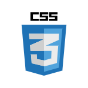
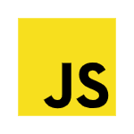
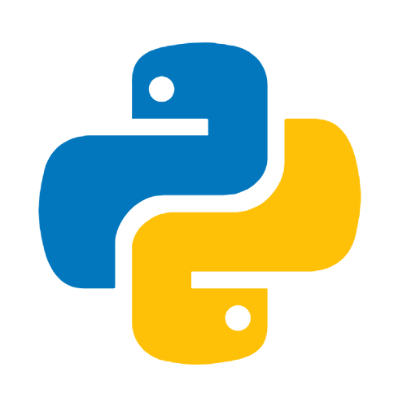
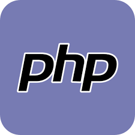
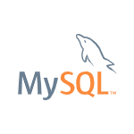
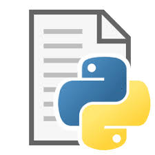
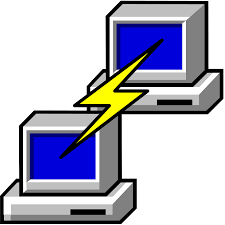

# 🎯 S1 LAB PROGRAMS

Welcome to the **S1 Lab Programs Repository**! This repository contains various programming exercises and projects developed using multiple languages and development environments.

---

## 🚀 Programming Languages

  
  
  

  
  
  
  

---

## 🖥️ Development Environments (IDLEs)

  
  
  

---

## 📂 Repository Contents

🔹 Hands-on lab programs for different programming languages. 
🔹 Step-by-step guides and project documentation. 
🔹 Reference materials for better understanding of concepts. 

---

## 📢 Stay Connected

🚀 Keep checking for new updates and improvements!

📌 *Happy Coding!* 🎯
