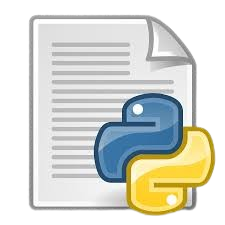
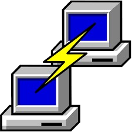
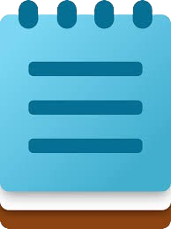

#🎯 S1-S3 MCA Lab Programs Repository
Welcome to the MCA Practical Repository! This repository contains practical assignments and programming exercises from Semester 1 to Semester 3 of the MCA program (21-23). Each folder corresponds to a specific lab subject, containing relevant files, code, and instructions to complete the practical tasks.

📚 Semesters & Lab Subjects
📌 Semester 1
Data Structures (C Lab)
Web Programming Lab
Python Programming Lab
📌 Semester 2
Database Management Systems (DBMS) Lab
Networking (Linux Lab)
Java Lab
📌 Semester 3
Android App Development (Java Lab)
Data Science (Python Lab)
🚀 Programming Languages

    
 
      

🖥️ Development Environments (IDLEs)

     

📂 Repository Contents
🔹 Hands-on lab programs for multiple programming languages.
🔹 Practical assignments and projects categorized by semester.
🔹 Step-by-step guides and project documentation.
🔹 Reference materials for better understanding of concepts.

📢 Stay Connected
🚀 Keep checking for updates and improvements!

📌 Happy Learning & Coding! 🎯
